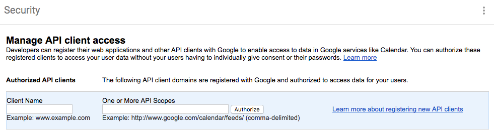
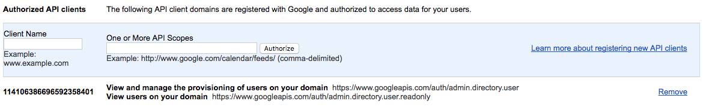

# Automated GSuite Account Creation

Researcher accounts must be Google accounts to interact with FireCloud and they must be created in a custom GSuite domain so that we can enforce two-factor authentication. Therefore, automated account creation means automatically creating a new GSuite user. Automating tasks using Google APIs is usually accomplished via a service account.

The target API in this case is Google's User Admin or Directory API. Google has documentation for how to use a service account in this way [1].

[1] https://developers.google.com/identity/protocols/OAuth2ServiceAccount

According to the documentation, after creating the service account, you can delegate access to certain API scopes using the Admin console [1] [2]. In this case, "Client Name" is the client ID of the service account and the scopes are a comma-delimited list. In fact, if you use the email address of the service account in the Client Name field, it will be replaced by the client ID of the account, so this page does seem to have some knowledge about service accounts generally.


[1] Admin Console


[2] Service Account Added

It is a red herring.

Attempting to access the directory API fails with authorization errors:
```java
List<String> SCOPES = Arrays.asList(DirectoryScopes.ADMIN_DIRECTORY_USER_READONLY);
GoogleCredential credential;
try (InputStream is = new FileInputStream("./fake-research-aou-5db00a85f01b.json")) {
  credential = GoogleCredential.fromStream(is);
}
return credential.createScoped(SCOPES);
```

This leaves the option of impersonating an admin user:
```java
GoogleCredential credential;
try (InputStream is = new FileInputStream("./fake-research-aou-5db00a85f01b.json")) {
  credential = GoogleCredential.fromStream(is);
}
return new GoogleCredential.Builder()
    .setTransport(getDefaultTransport())
    .setJsonFactory(getDefaultJsonFactory())
    .setServiceAccountUser("dmohs@fake-research-aou.org") // <--- mail of domain's admin
    .setServiceAccountId(credential.getServiceAccountId())
    .setServiceAccountScopes(SCOPES)
    .setServiceAccountPrivateKey(credential.getServiceAccountPrivateKey())
    .setServiceAccountPrivateKeyId(credential.getServiceAccountPrivateKeyId())
    .setTokenServerEncodedUrl(credential.getTokenServerEncodedUrl()).build();
```

This method works. Since this isn't really a case where want the service account acting as a real person, we can create an admin user specifically for the service account to impersonate (e.g., directory-service@fake-research-aou.org).
