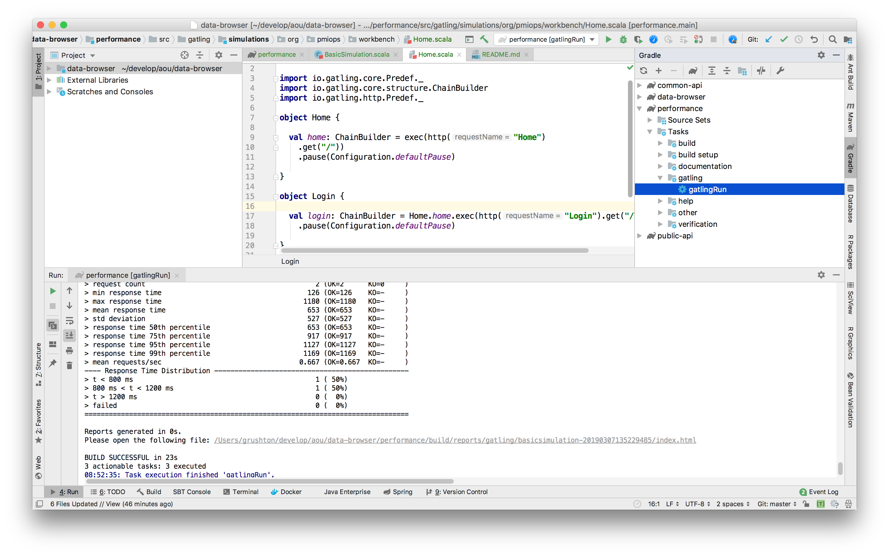

# Performance Testing with Gatling

* [Gatling Documentation](https://gatling.io/docs/current/)
* [Gradle Plugin Documentation](https://github.com/lkishalmi/gradle-gatling-plugin)

## Running Tests

From the `performance` directory, run the gatling tests which defaults to running against the 
stable environment:
```shell
gradle gatlingRun
```

Tests can also be run against a specific environment by specifying `-Denv=<ENV>`. 
Available options for `env` are `local`, `test`, `staging`, `stable`, or `prod`:
```shell
gradle gatlingRun -Denv=test
```

Tests can also be run from inside IntelliJ. Execute the `gatlingRun` 
gradle task (which uses the default `stable` environment ) as shown in 
this screenshot: 

Test runs are stored in `performance/build/reports/gatling/`

## Writing Tests

Tests are broken down into `Scenarios`. Each scenario is comprised of a series of `Pages`
Some pages require a series of steps to get to, so each scenario should build upon existing
`Page` objects to get to a final destination.

* [Gatling Cheat Sheet](https://gatling.io/docs/current/cheat-sheet/)
